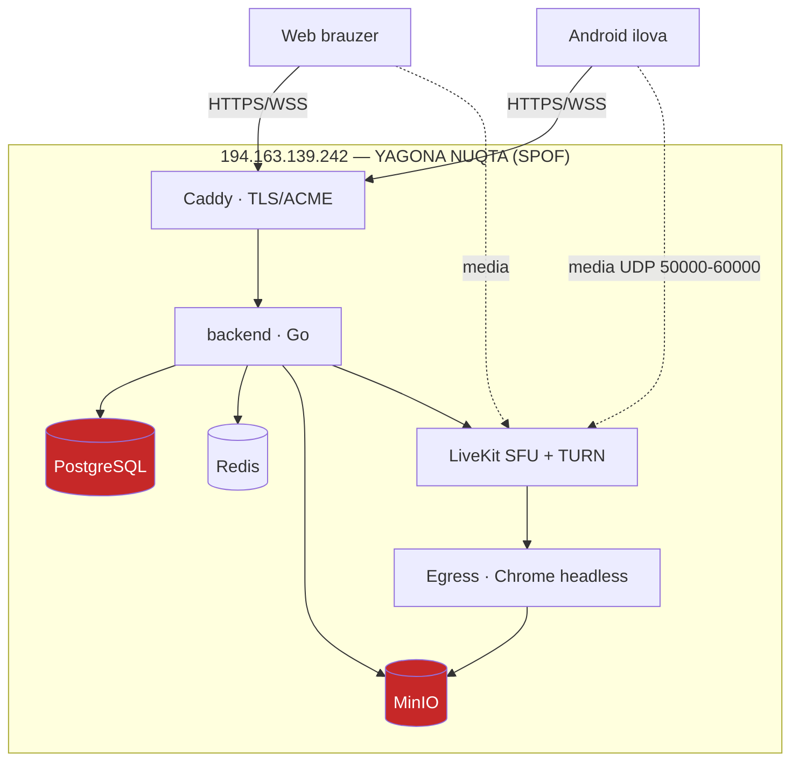
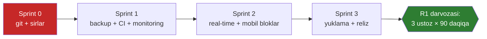

# Darsly — Production Readiness Assessment & Roadmap

> Sana: **2026-07-27** · Baholovchi: CPTO + 4 ixtisoslashgan audit agenti
> Manba: haqiqiy kod bazasi (o'lchovlar va fayl:satr dalillari bilan), qurilma sinovi natijalari
> Bog'liq hujjatlar: `MOBILE-STATUS.md` · `MOBILE-DEVICE-TEST.md` · `mvp-todo.md` · `darsly-mobile-roadmap.md`

---

## 0. EXECUTIVE SUMMARY

**Mahsulot funksional jihatdan pilotga tayyor, lekin operatsion jihatdan production EMAS.**

| O'lchov | Holat |
|---|---|
| Funksional to'liqlik (MVP) | ✅ Uchdan-uchga ishlaydi: auth → dars → video → kutish xonasi → yozib olish → bildirishnoma |
| Mobil ilova | ✅ Qurilmada 25 mezon tasdiqlangan (ekran ulashish, fon rejimi, ekran audiosi) |
| **Versiya nazorati** | 🔴 **YO'Q** — `.git` mavjud emas |
| **Zaxira nusxa (backup)** | 🔴 **YO'Q** — RPO = ∞ |
| **CI** | 🔴 Fayl yozilgan, **hech qachon ishlamagan** (git yo'qligi sababli) |
| Monitoring | 🟠 Kod to'liq, **prod'da o'chiq** (DSN/URL berilmagan) |
| Test qamrovi | 🟠 Backend **53.2% lokal / 32.5% CI'da** · Mobil 165 test · **Frontend 0** |

### Bitta jumlada
> Bugun serverning diski ishdan chiqsa — **butun mahsulot yo'qoladi**: kod ham (git yo'q),
> ma'lumot ham (backup yo'q). Bu — 3 ta pilot ustozdan oldin yopilishi shart bo'lgan yagona blok.

### Uch eng katta risk (ta'sir × ehtimollik)

| # | Risk | Ta'sir | Yopish narxi |
|---|---|---|---|
| 1 | Git yo'q → kod tarixi, rollback, code review, CI — hech biri yo'q | Loyiha yo'qolishi | **2–3 soat** |
| 2 | Backup yo'q → foydalanuvchi/dars/yozuvlar tiklanmaydi | Mijoz ishonchi | **4–6 soat** |
| 3 | Sirlar hujjatlarda ochiq (VPS root paroli) | Server egallanishi | **2 soat** |

**Xulosa:** 3 ta eng katta riskning umumiy narxi — **~1.5 ish kuni**. Bu qadamlarsiz boshqa
har qanday rivojlanish qumga qurilgan bo'ladi.

---

## 1. PHASE 1 — CURRENT STATE ASSESSMENT

### 1.1 Kod bazasi (o'lchangan)

| Komponent | Kod hajmi | Test fayllari | Izoh |
|---|---|---|---|
| Backend (Go + Gin) | **17 872** qator | 38 | Clean Architecture, 60 endpoint, 10 migratsiya |
| Frontend (React + Vite) | **4 702** qator | **0** | MSW handler'lari bor, test yo'q |
| Mobil (Kotlin + Compose) | **7 906** qator | 23 fayl / **165 test** | Vakuum tekshiruvidan o'tgan |

### 1.2 Infratuzilma (bitta Contabo VPS: 4 yadro, 7.8 GB, 145 GB)

🔴 Qizil komponentlar — **zaxira nusxasi yo'q**, yo'qolsa tiklab bo'lmaydi.

### 1.3 Real-time qamrovi (bugungi holat)

Backend faqat **2 xil hodisa** yuboradi (`websocket/notify.go`, `waitingroom.go`):

| Hodisa | Kim oladi | Ishlatilishi |
|---|---|---|
| `notification` | Foydalanuvchi | Web: toast + ro'yxat yangilash · Mobil: ✅ ulandi |
| `waiting_room.request/admitted/rejected` | Mentor / guest | Web: ✅ · Mobil: ✅ klient tayyor (4-blokda UI) |

**Bo'shliq:** dars holati o'zgarishi (`live`/`ended`), ishtirokchi qo'shilishi, yozib olish
holati — **hech qaysi klientga push qilinmaydi**. Ustoz webda darsni yakunlasa, telefondagi
ro'yxat eskirgan holicha qoladi (faqat qo'lda yangilashda tuzaladi).

---

## 2. SUB-AGENT REPORTS

### 2.1 🛠 DevOps & Infrastructure Agent

**"Bugun bor / yo'q" jadvali:**

| Soha | Holat | Dalil |
|---|---|---|
| Backup | 🔴 **YO'Q** | `pg_dump`/cron grep = 0 |
| Monitoring | 🟠 Kod bor, prod'da **o'chiq** | `router.go:98` `/metrics`, `app.go:68` Sentry — prod `.env` da DSN yo'q |
| Alerting | 🔴 YO'Q | — |
| CI | 🔴 Fayl bor, **ishlamaydi** | `.github/workflows/ci.yml` + dublikat `backend/.github/workflows/ci.yml` |
| Staging | 🔴 YO'Q | bitta VPS demo + sinov uchun |
| Rollback | 🔴 YO'Q | git yo'q + `:latest` tag'lar + migratsiya faqat `Up()` |
| IaC | 🟠 Qisman | `remote-setup.sh` idempotent va sifatli |
| Secrets | 🟠 Qisman | serverda `openssl rand` ✅, lekin root parol `CLAUDE.md:195` da ochiq |

**Eng muhim topilmalar:**

| # | Daraja | Topilma | Dalil | Mehnat |
|---|---|---|---|---|
| 1 | 🔴 KRITIK | Loyiha git ostida emas → CI o'lik, rollback nol | `git status` → not a repository | 2–3 s |
| 2 | 🔴 KRITIK | Backup yo'q + SPOF → **RPO = ∞**, ma'lumot uchun RTO = cheksiz | `docker-compose.yml:19-23` | 4–6 s |
| 3 | 🔴 KRITIK | Sirlar hujjatlarda: VPS root paroli, seed admin paroli 4 joyda | `CLAUDE.md:195` | 2 s |
| 4 | 🟠 YUQORI | Monitoring prod'da yoqilmagan (Sentry/Loki/OTEL — jim no-op) | `remote-setup.sh:40-93` | 6–8 s |
| 5 | 🟠 YUQORI | Compose gigiyenasi: backend/caddy/livekit/egress'da **healthcheck yo'q**, resurs limiti yo'q, log rotatsiyasi yo'q, `:latest` tag | `deploy/server/docker-compose.yml` | 3–4 s |

**Qo'shimcha:** migratsiya rollback sinalmagan · MinIO lifecycle yo'q (disk to'lish xavfi) ·
mobil release imzosiz (`signingConfigs` yo'q, R8 o'chiq, ABI split yo'q) · TURN TLS 443 yoqilmagan ·
e2e/playwright CI'da chaqirilmaydi.

### 2.2 🔐 Security Agent

**Umumiy baho:** kriptografiya va IDOR himoyasi **kuchli**, lekin **konfiguratsiya va sessiya
bekor qilish** qatlamida jiddiy teshiklar bor. Ijobiy tomoni — auditor 12 sohani "toza" deb
tasdiqladi (SQL injection, IDOR, parol hash, refresh rotatsiya/reuse-detektor, rate-limit
fail-safe, LiveKit token scope, webhook imzosi, CORS/WS Origin, log redaksiyasi, mobil saqlash).

#### 🔴 KRITIK — bugun jonli serverda ochiq

| # | Topilma | Dalil | Hujum stsenariysi | Mehnat |
|---|---|---|---|---|
| **K-1** | **Production admin paroli qattiq yozilgan va uchta hujjatda oshkor edi** — boshqa hamma sir `gen()` bilan yasaladi, bu esa qattiq yozilgan | `remote-setup.sh:47-48` + 3 ta hujjatda | Ochiq internetdagi `POST /auth/login` → admin token → `PUT /users/:id/password` → **butun platforma egallanadi** | 2 s |
| **K-2** | **VPS root paroli repo hujjatida ochiq** | `CLAUDE.md:195,197` | Fayl har agent/backup/kontekstga tushadi; serverda `tgbot` va `eduverse` ham bor — zarar doirasi kengroq | 1 s |

#### 🟠 YUQORI

| # | Topilma | Dalil | Nima buziladi | Mehnat |
|---|---|---|---|---|
| **Y-1** | Parolni almashtirish **boshqa sessiyalarni o'ldirmaydi** (reset va admin-reset o'ldiradi, `/users/me/password` yo'q) | `usecase/user/user.go:133-159` | Token o'g'irlangan qurbon parolini almashtiradi — hujumchi sessiyasi **tirik qoladi va TTL har rotatsiyada yangilanadi** | 1 s |
| **Y-2** | O'chirilgan foydalanuvchi sessiyasi ishlashda davom etadi | `user.go:244-257`, `token/jwt.go:127-148` | Ishdan bo'shagan xodim dars yaratish/yozuv yuklab olishni davom ettiradi | 0.5 s |
| **Y-3** | Rol pasaytirilganda eski `role` claim **abadiy** saqlanadi (`Rotate` roldni DB'dan o'qimaydi) | `user.go:119-124`, `jwt.go:244-252` | Adminlikdan olingan foydalanuvchi admin endpointlarida qoladi | 1.5 s |
| **Y-4** | SPA'da **CSP/HSTS/X-Frame-Options yo'q** + tokenlar `localStorage`da (refresh 30 kun) | `Caddyfile:8-42`, `api/api.jsx:14-28` | Bitta XSS yoki buzilgan npm paketi → 30 kunlik refresh o'g'irlanadi (Y-1 tufayli parol almashtirish qutqarmaydi) | 4 s |

#### 🟡 O'RTA

| # | Topilma | Nima buziladi |
|---|---|---|
| **O-1** | Redis xatosida auth **fail-open** (`jwt.go:138-145`) — bekor qilingan tokenlar qayta ishlaydi |
| **O-2** | Join-parol lockout **butun dars** uchun global (`joinlink.go:19-24`) → istalgan kishi 5 ta noto'g'ri parol bilan **hamma o'quvchini** 5 daqiqaga bloklaydi |
| **O-3** | LiveKit'da kick ≠ ban: token 6 soat yaroqli + `room.auto_create` yoqilgan → chiqarilgan buzg'unchi qaytib ulanadi va yopilgan xonani **qayta yaratadi** |
| **O-4** | So'rovnomada ovoz to'ldirish: har join yangi identity beradi → 100 ta soxta ovoz |
| **O-5** | `GET /polls/:id/results` **tokensiz ochiq** (`router.go:210`) |

#### OWASP Top-10 (2021) qamrovi

| Kategoriya | Holat |
|---|---|
| A01 Broken Access Control · A02 Crypto · A04 Insecure Design · A07 Auth | ⚠️ qisman |
| A03 Injection · A08 Integrity · A09 Logging | ✅ qoplangan |
| **A05 Security Misconfiguration** | ❌ **qoplanmagan** (K-1, O-3, Y-4, ochiq registratsiya) |
| A06 Vulnerable Components | ➖ tekshirilmagan (`govulncheck`/`npm audit` kerak) |
| A10 SSRF | ➖ mavjud emas |

### 2.3 🧱 Backend Quality Agent

`go build` ✅ · `go vet` ✅ · `go test -race` ✅ (race yo'q). Lekin **qamrov o'lchovi katta muammoni ochdi.**

#### Test qamrovi — o'lchangan raqamlar

| Rejim | Umumiy qamrov | Faqat prod kod |
|---|---|---|
| Lokal (Postgres+Redis ishlayapti) | **53.2%** | 52.0% |
| **CI holati (DB yetib bo'lmaydi)** | **32.5%** | 28.3% |

> **20.7 punkt qamrov CI'da jimgina yo'qoladi** — pastdagi F-1.

**Eng past paketlar:** `internal/worker` **0%** (56 statement — eslatma dedup + email retry,
ya'ni distributed-correctness mantiqi) · `infrastructure/email` 1.8% · `minio` 2.6% · `livekit` 25.8%.
**Yaxshi qoplanganlar:** `usecase/joinlink` 95.5% · `chat` 85.7% · `notification` 84.6% · `room` 80.9% · `api` 80.1%.

#### Topilmalar

| # | Daraja | Topilma | Dalil | Mehnat |
|---|---|---|---|---|
| **F-1** | 🔴 KRITIK | **CI 50+ integratsiya testini jimgina skip qiladi** — CI Postgres'ni `5432`ga map qiladi, `testutil` esa `5442` kutadi; ulanolmasa `t.Skipf` → paket baribir `ok` ko'rinadi | `ci.yml:23` ↔ `testutil/pg.go:43` | 20 daq |
| **F-2** | 🔴 KRITIK | Rol pasaytirilganda/foydalanuvchi o'chirilganda **sessiya bekor qilinmaydi**; `Rotate` rolni eski token claim'idan meros qiladi | `usecase/user/user.go:119-131,244-257`, `jwt.go:161` | 1 s |
| **F-3** | 🟠 YUQORI | `GET /polls/:id/results` — `protected` guruhda emas, avtorizatsiyasiz ochiq | `router.go:210` | 40 daq |
| **F-4** | 🟠 YUQORI | `poll`/`chat` da `shared.ValidateID` yo'q → `"abc"` UUID ustuniga yetadi → **auth'siz 500 generatori** (Sentry ko'miladi) | `usecase/poll/poll.go:47,68,91` | 20 daq |
| **F-5** | 🟠 YUQORI | `WithTx` — **0 ta chaqiruv joyi**. `reminder.tick`da claim muvaffaqiyatli, `Notify` yiqilsa eslatma **butunlay yo'qoladi** | `internal/worker/reminder.go:50-62` | 1.5 s |
| **F-6** | 🟠 YUQORI | SMTP `ctx`ni e'tiborsiz qoldiradi (`smtp.SendMail` deadline olmaydi) → worker **abadiy osiladi**; email worker'da cheksiz requeue (poison message) | `email/email.go:105`, `worker/email.go:68-72` | 2 s |
| **F-7** | 🟠 YUQORI | `internal/worker` **0% qamrov** — aynan dedup/retry mantiqi sinovsiz | — | 3 s |
| F-8…F-15 | 🟡/⚪ | LiveKit timeout'lari izchil emas · `MuteAll` 100 ishtirokchida ~200-300 ketma-ket HTTP · `refresh_tokens` **cheksiz o'sadi** (tozalash chaqirilmaydi) · `users` qidiruvida **to'liq skan** (email uchun trgm indeks yo'q) · Casbin nisbiy yo'l → noto'g'ri cwd'da hamma endpoint 503 · Makefile integratsiya testi ishlamaydi · `poll.go:94` qatlam buzilishi · slug modulo bias | | ~5 s |

#### Ikki agent mustaqil ravishda bir xil xatoni topdi

| Topilma | Security | Backend |
|---|---|---|
| Sessiya bekor qilinmasligi (rol/o'chirish) | Y-2, Y-3 | F-2 |
| `/polls/:id/results` ochiq | O-5 | F-3 |

> Bu tasodif emas — ikkala tekshiruv ham bir xil xulosaga kelgani topilmalarning **haqiqiyligini** kuchaytiradi.

**Ijobiy:** SQL injection yo'q (Squirrel + allow-list) · 33 ta himoyalangan route Casbin'da birma-bir
qoplangan · xato formatida ichki tafsilot sizmaydi · **N+1 topilmadi** (mentor nomi Redis'da,
`ensureRoomOnce` singleflight bilan) · qatlam yo'nalishi import darajasida toza.

### 2.4 🎨 Frontend & Real-time (CPTO to'g'ridan-to'g'ri auditi)

| # | Daraja | Topilma | Dalil |
|---|---|---|---|
| 1 | 🟠 YUQORI | **Frontend testlari 0 ta** — MSW handler'lari bor, test fayli yo'q | `frontend/src/test/` |
| 2 | 🟠 YUQORI | Real-time faqat 2 ekranda: global store va kutish xonasi | `store/app.jsx:44`, `views/WaitingRoom.jsx` |
| 3 | 🟡 O'RTA | 14 ta ekran, lekin dars holati o'zgarishi jonli yangilanmaydi | `views/Dashboard.jsx` |

**Ijobiy:** dizayn tizimi to'liq tokenlashtirilgan (`styles.css` — ranglar, radiuslar, soyalar);
WS hodisasi kelganda React Query invalidatsiyasi + toast — **to'g'ri naqsh**, uni kengaytirish arzon.

### 2.5 📱 Mobile Agent (qurilma sinovi natijalari)

| Ko'rsatkich | Natija |
|---|---|
| Qurilmada tasdiqlangan mezonlar | **25** (ekran ulashish, fon rejimi, ekran audiosi, offline, ruxsatlar) |
| Yiqilgan mezon | **1** — C-11 (tarmoq almashuvi); sinov kuchsiz 3G'da o'tgan, LTE'da takrorlash kerak |
| Unit testlar | 165 (0 FAIL), vakuum tekshiruvidan o'tgan |
| Lint | 0 xato, 32 ogohlantirish (hammasi bog'liqlik versiyalari) |
| Release tayyorligi | 🔴 imzo yo'q, R8 o'chiq, 66 MB |

---

## 3. PHASE 2 — DESTINATION DEFINITION

### 3.1 Standartlarni "to'g'ri o'lchamga" keltirish (muhim qaror)

Sizning shablon 99.99% uptime, Kubernetes, mikroservis, ISO 27001 ni talab qiladi.
**Men bularning bir qismini ataylab rad etaman** — sabablari bilan:

| Shablon talabi | Qaror | Asos (xalqaro amaliyot) |
|---|---|---|
| Mikroservis / K8s | ❌ **Rad etiladi** | 3 ta pilot ustoz, 17k qator monolit. Google SRE va Martin Fowler ("MonolithFirst") bir xil maslahat beradi: mikroservisga o'tish **tashkiliy** muammo yechilganda ma'noli. Hozir K8s faqat operatsion yukni oshiradi |
| 99.99% uptime | ❌ → **99.5%** | 99.99% = yiliga 52 daqiqa. Bu multi-region + 24/7 navbatchilik demak. Dars vaqti belgilangan (kunning ma'lum soatlari) — **rejalashtirilgan oyna** bilan 99.5% (yiliga 1.8 kun) yetarli va o'lchanadigan |
| 80% test qamrovi (blanket) | 🟡 → **kritik yo'llarda 70%+** | Blanket qamrov Goodhart qonuniga tushadi. Maqsad: auth, to'lov-oqim (kelajakda), dars yaratish/kirish, kutish xonasi — 70%+; UI/DTO qatlamlari uchun majburiy emas |
| ISO 27001 / GDPR to'liq | 🟡 → **amaliy minimum** | Sertifikat mijoz talab qilmaguncha ortiqcha. Lekin **Play Store majburiy** qiladi: maxfiylik siyosati, Data Safety, **akkaunt o'chirish** |
| Latency < 200ms | ✅ **Qabul** (p95 < 300 ms) | Media latency LiveKit zimmasida; API uchun p95 < 300 ms realistik (hozir Toshkent↔VPS RTT ~120 ms) |

### 3.2 "100% tayyor" ta'rifi — o'lchanadigan mezonlar

| Soha | Mezon | Bugun | Maqsad |
|---|---|---|---|
| Versiya nazorati | Git + remote + PR oqimi | ❌ | ✅ |
| CI | Har push'da build+vet+lint+test yashil | ❌ | ✅ (mobil ham) |
| Backup | Kunlik dump + offsite + **tiklash mashqi** | ❌ | RPO ≤ 24 s, RTO ≤ 2 s |
| Monitoring | Sentry + `/metrics` + alert (uptime, xato darajasi) | ❌ | ✅ |
| Test | Backend kritik yo'llar 70%+ · Frontend smoke · Mobil 165+ | qisman | ✅ |
| Xavfsizlik | OWASP Top-10 bo'yicha kritik/yuqori = 0 | ? | ✅ |
| Ishlash | API p95 < 300 ms · xonaga ulanish < 3 s | o'lchanmagan | ✅ |
| Mobil reliz | Imzolangan APK + R8 + ABI split | ❌ | ✅ |
| Hujjat | Runbook (tiklash, deploy, rollback) | qisman | ✅ |

---

## 4. PHASE 4 — ROADMAP (MoSCoW + Sprintlar)

### Sprint 0 — "Poydevorni qutqarish" (1 kun) · **MUST**

> Bu sprint tugamaguncha boshqa hech narsa boshlanmaydi. Sababi: bugun har qanday
> yozilgan kod bir nusxada va tarixsiz.

- [ ] **Ildizga `.gitignore`** (hozir yo'q): `.env`, `local.properties`, `dist/`, `www/`, `app/build/` (333 MB), `bin/` (80 MB)
- [ ] `git init` + birinchi commit + **remote** (GitHub; gitlab.com loyiha qoidasi bo'yicha ishlatilmaydi)
- [ ] Dublikat `backend/.github/workflows/ci.yml` o'chirilsin (Go versiyasini hardcode qiladi)
- [ ] **Sirlarni almashtirish**: VPS root paroli, seed admin paroli; hujjatlardan olib tashlash
- [ ] SSH kalitga o'tish + `PermitRootLogin prohibit-password`

### Sprint 1 — "Operatsion xavfsizlik" (1 hafta) · **MUST**

- [ ] **Backup**: kunlik `pg_dump | gzip` + MinIO `mc mirror` → offsite; **haftalik tiklash mashqi**
- [ ] **CI'ni haqiqatan ishlatish (F-1)**: `ci.yml` ga `TEST_DB_*`/`TEST_REDIS_*` env'lari — hozir
      50+ integratsiya testi jimgina skip bo'ladi va CI baribir yashil ko'rinadi
- [ ] CI ga mobil `testDebugUnitTest` va frontend smoke qo'shilsin
- [ ] **Sessiya bekor qilish (F-2 / Y-1 / Y-2 / Y-3)** — bitta patch, uchta oqim:
      parol almashtirish · foydalanuvchi o'chirish · rol o'zgarishi
- [ ] Monitoring yoqilsin: Sentry DSN, `/metrics` → Prometheus, uptime alert (Telegram bot)
- [ ] Compose gigiyenasi: 4 ta healthcheck, resurs limitlari, log rotatsiyasi, image tag'larini pin qilish
- [ ] Xavfsizlik agenti topgan kritik/yuqori bandlar (2.2 bo'limi)

### Sprint 2 — "Mahsulot to'liqligi" (2–3 hafta) · **SHOULD**

- [ ] **Real-time kengaytirilishi** (foydalanuvchi talabi): backend `lesson.started/ended/updated`,
      `participant.joined/left`, `recording.ready` hodisalarini yuborsin → web va mobil ikkalasi
      ham **yangilashsiz** ko'rsin
- [ ] Mobil 4-blok: kutish xonasi UI, ishtirokchilar, so'zlashga ruxsat, darsni yakunlash
- [ ] Mobil 5-blok: **xona redizayni** (video sahna, boshqaruv paneli, brend tokenlari)
- [ ] Frontend: smoke testlar (Playwright allaqachon bor — CI'ga ulash)
- [ ] C-11 ni LTE muhitida qayta sinash + LiveKit reconnect siyosati

### Sprint 3 — "Reliz tayyorligi" (1–2 hafta) · **SHOULD**

- [ ] Yuklama testi: 25 ishtirokchi × 3 parallel dars (skriptlar `backend/tests/load/` da tayyor)
- [ ] Mobil imzolangan APK + R8 + ABI split (66 MB → ~15 MB)
- [ ] Play Store majburiylari: maxfiylik siyosati, Data Safety, **akkaunt o'chirish**
- [ ] Runbook: tiklash, deploy, rollback, incident tartibi
- [ ] 3 ta pilot ustoz bilan 90 daqiqalik haqiqiy dars (R1 darvozasi)

### WON'T HAVE (hozircha ataylab qilinmaydi)

Kubernetes · mikroservis · multi-region · ISO 27001 sertifikati · avtomatik gorizontal masshtab.
**Sabab:** foydalanuvchi soni buni talab qilmaydi; operatsion murakkablik pilotni sekinlashtiradi.
Qayta ko'rib chiqish sharti: **> 200 bir vaqtdagi dars** yoki korporativ mijoz talabi.

---

## 5. NAZORAT RO'YXATI — "Production" deb aytish uchun

| # | Band | Javobgar agent | Holat |
|---|---|---|---|
| 1 | Git + remote + CI yashil | DevOps | ⬜ |
| 2 | Backup + tiklash mashqi | DevOps | ⬜ |
| 3 | Sirlar almashtirilgan | Security | ⬜ |
| 4 | Kritik/yuqori xavfsizlik topilmalari yopilgan | Security | ⬜ |
| 5 | Monitoring + alerting | DevOps | ⬜ |
| 6 | Real-time hodisalar to'liq | Backend + Frontend | ⬜ |
| 7 | Mobil 4/5-blok + redizayn | Mobile | ⬜ |
| 8 | Yuklama testi o'tgan | QA | ⬜ |
| 9 | Imzolangan APK + Play talablari | Mobile | ⬜ |
| 10 | 3 pilot ustoz darsi | PM | ⬜ |
